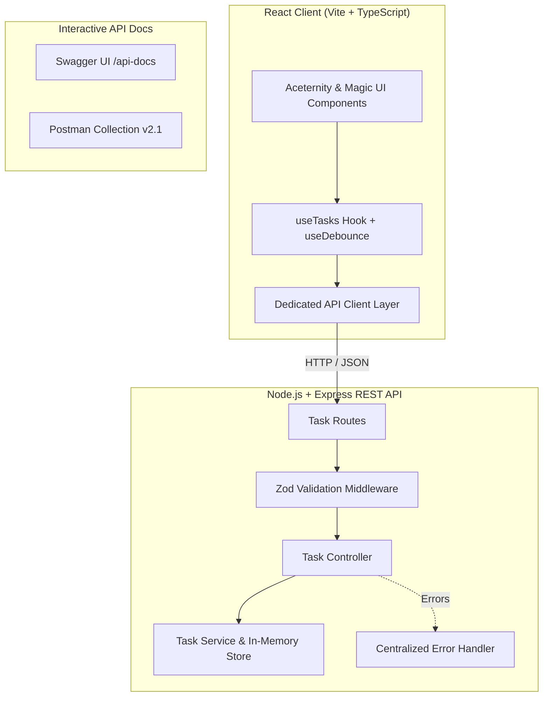

# TaskFlow — Full-Stack Task Management System

> 🌐 **Live Demo:** [https://task-management-system-mu-drab.vercel.app/](https://task-management-system-mu-drab.vercel.app/)  
> 📦 **GitHub Repository:** [https://github.com/vanshsinghn1-spec/task-management-system](https://github.com/vanshsinghn1-spec/task-management-system)

A high-performance, full-stack task management application engineered for the **Full-Stack Developer Internship Assignment**. Built with a robust **Node.js/Express 3-Tier REST API** (with in-memory persistence) and a modern **React + Vite** frontend.

---

## Architecture Overview



---

## Evaluation Criteria Compliance

| Evaluation Area | Weight | Features Implemented |
| :--- | :--- | :--- |
| **UI / UX & Responsiveness** | 20% | Aceternity Card Spotlight, Magic UI Shimmer buttons & Number Ticker, dark/light theme toggle, mobile drawer & touch-friendly controls. |
| **React / Frontend Implementation** | 20% | Modular component design, custom hooks (`useTasks`, `useDebounce`), zero monolithic files, strict TypeScript interfaces. |
| **REST API Design & Integration** | 20% | RESTful endpoints (`GET`, `POST`, `PUT`, `DELETE`), semantic status codes (200, 201, 400, 404), query parameters for filtering/sorting/pagination. |
| **Backend Architecture & Code Quality** | 20% | Strict 3-tier layering: `routes/` ➔ `controllers/` ➔ `services/` with in-memory persistence, pre-seeded sample tasks. |
| **Validation & Error Handling** | 10% | Zod schema validation on backend request bodies; interactive client-side form validation; centralized error handling middleware. |
| **Documentation & Git Practices** | 10% | Interactive Swagger UI (`/api-docs`), Postman Collection export (`postman_collection.json`), conventional git commits. |

---

## Features & Highlights

- **Linear / Raycast Aesthetics**: Minimalist, clean dashboard with high visual polish, zero generic template look.
- **Dual View Modes**:
  - **List / Table View**: High-density view with sortable columns and pagination.
  - **Kanban Board**: Drag/status visual workflow split into *Pending*, *In Progress*, and *Completed*.
- **Live Search with 300ms Debounce**: Instant query matching title and description with zero layout flicker.
- **Rich Multi-Filtering & Sorting**: Filter by status and priority; sort by due date, created date, or priority.
- **Interactive Slide-over Drawer**: Inspect complete task metadata, unique UUIDs, and audit timestamps.
- **Client & Server Validation**: Required fields (Title, Description) enforced with meaningful feedback.
- **Optimistic Updates & Undo Action**: Deleting a task presents a toast with one-click undo restoration.
- **Confetti Milestone**: Completing a task triggers particle confetti feedback.

---

## Tech Stack

### Frontend
- **Framework**: React 19 + TypeScript + Vite
- **Styling**: Tailwind CSS
- **Design System**: shadcn/ui primitives + Aceternity UI (`CardSpotlight`, `BackgroundGrid`) + Magic UI (`ShimmerButton`, `NumberTicker`)
- **Icons & Animations**: Lucide React, Framer Motion, Canvas Confetti

### Backend
- **Runtime**: Node.js (v18+)
- **Framework**: Express.js
- **Persistence**: In-Memory Store (Array-based singleton service)
- **Validation**: Zod
- **Documentation**: Swagger UI (`swagger-ui-express`) + OpenAPI 3.0
- **Utilities**: CORS, Morgan logger, UUID v4

---

## Quick Start Guide

### Prerequisites
- **Node.js**: v18.0.0 or higher
- **npm**: v9.0.0 or higher

### 1. Installation

Clone or extract the repository and run:

```bash
# Install root dependencies
npm install

# Install all sub-project dependencies (backend + frontend)
npm run install:all
```

*(Alternatively, run `npm install` inside both `backend/` and `frontend/` folders).*

---

### 2. Running Locally (One Command)

From the project root directory, run:

```bash
npm run dev
```

This concurrently launches:
- **Backend API**: `http://localhost:5000`
- **Frontend App**: `http://localhost:5173`
- **Interactive Swagger Docs**: `http://localhost:5000/api-docs`

---

### 3. Running Separately (Optional)

If you prefer separate terminal windows:

**Terminal 1 (Backend):**
```bash
cd backend
npm run dev
```

**Terminal 2 (Frontend):**
```bash
cd frontend
npm run dev
```

---

## REST API Specification

Base URL: `http://localhost:5000/api/tasks`

| Method | Endpoint | Description | Query / Body Params | Status Codes |
| :--- | :--- | :--- | :--- | :--- |
| `GET` | `/api/tasks` | Get all tasks | `search`, `status`, `priority`, `sortBy`, `sortOrder`, `page`, `limit` | `200 OK` |
| `GET` | `/api/tasks/stats/summary`| Get metric counts | None | `200 OK` |
| `GET` | `/api/tasks/:id` | Get single task | `id` (path) | `200 OK`, `404 Not Found` |
| `POST` | `/api/tasks` | Create task | `{ title, description, status, priority, dueDate }` | `201 Created`, `400 Bad Request` |
| `PUT` | `/api/tasks/:id` | Update task | `{ title, description, status, priority, dueDate }` | `200 OK`, `400 Bad Request`, `404 Not Found` |
| `DELETE` | `/api/tasks/:id` | Delete task | `id` (path) | `200 OK`, `404 Not Found` |

### Swagger Documentation
Visit `http://localhost:5000/api-docs` in your browser to test endpoints interactively via Swagger UI.

### Postman Collection
Import `backend/postman_collection.json` into Postman to run preconfigured requests with environment variables.

---

## Project Structure

```
cleano_ass/
├── backend/
│   ├── src/
│   │   ├── config/
│   │   │   └── swagger.js             # OpenAPI/Swagger 3.0 specification
│   │   ├── controllers/
│   │   │   └── task.controller.js     # HTTP request handlers & response formatting
│   │   ├── middleware/
│   │   │   ├── errorHandler.js        # Centralized error handler
│   │   │   └── validate.js            # Zod validation middleware
│   │   ├── routes/
│   │   │   └── task.routes.js         # REST route definitions
│   │   ├── services/
│   │   │   └── task.service.js        # Business logic & in-memory task repository
│   │   ├── data/
│   │   │   └── seedTasks.js           # Pre-seeded realistic tasks
│   │   ├── app.js                     # Express app configuration & middleware
│   │   └── server.js                  # Server bootstrap & port listener
│   ├── postman_collection.json        # Postman Collection deliverable
│   ├── .env.example                   # Environment configuration example
│   └── package.json
│
├── frontend/
│   ├── src/
│   │   ├── components/
│   │   │   ├── aceternity/            # CardSpotlight, BackgroundGrid
│   │   │   ├── magicui/               # ShimmerButton, NumberTicker
│   │   │   ├── ui/                    # Button, Badge, Modal, Sheet, Input, Textarea, Select, Skeleton
│   │   │   ├── dashboard/             # MetricsBar, FilterBar
│   │   │   ├── tasks/                 # TaskCard, TaskListView, TaskKanbanView, TaskModal, TaskDetailSheet
│   │   │   └── layout/                # Navbar, Toast provider
│   │   ├── hooks/
│   │   │   ├── useTasks.ts            # State machine & optimistic CRUD hook
│   │   │   └── useDebounce.ts         # 300ms search debouncer
│   │   ├── services/
│   │   │   └── api.ts                 # Dedicated API client layer
│   │   ├── types/
│   │   │   └── task.ts                # TypeScript types & interfaces
│   │   ├── lib/
│   │   │   └── utils.ts               # Date formatters & class merger (cn)
│   │   ├── App.tsx                    # Primary view layout & orchestration
│   │   ├── main.tsx                   # React root render
│   │   └── index.css                  # Tailwind styles & theme variables
│   ├── .env.example
│   ├── package.json
│   └── vite.config.ts
│
├── package.json                       # Root script orchestrator (concurrently)
└── README.md                          # Project documentation
```

---

## Constraints Checklist
- [x] **No external databases** (PostgreSQL, MongoDB, MySQL, Firebase, etc.) — 100% backend memory storage.
- [x] **Clean 3-tier architecture** (`routes` ➔ `controllers` ➔ `services`).
- [x] **Client-side & server-side validation** with clear error responses.
- [x] **Responsive design** across desktop and mobile.
- [x] **Bonus points implemented**: Search with debounce, filter by status & priority, sort, pagination, dark mode, Swagger docs, and Postman collection.
